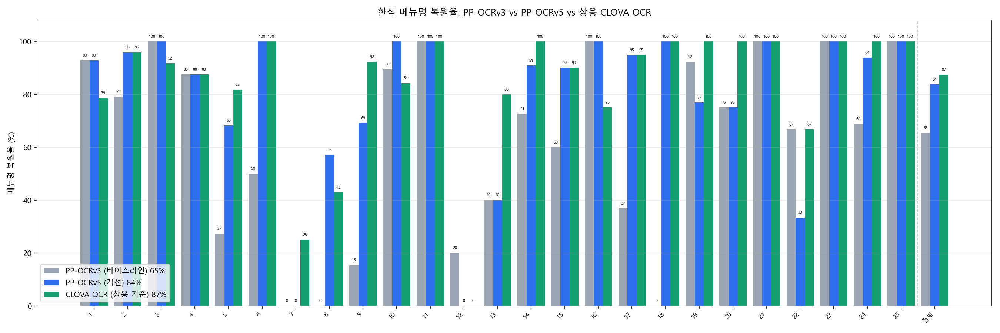

# 🍚 MenuEye — 한식 메뉴판 다국어 해석기

> 사진 한 장 → **OCR(CV)로 한글 인식** → **LLM이 다국어로 해석·안내**
> 방한 외국인이 한식 메뉴를 '못 읽고 못 이해하는' 문제를 CV + LLM으로 해결한다 (K-관광).

메뉴판을 촬영하면 각 요리의 **번역 · 소개 · 재료 · 조리법 · 맛(매운맛) · 알레르기 주의**를 목표 언어(영어 우선)로 안내한다.
※ 추천/필터링·헬스케어 아님, 가격 미포함. 알레르기는 단정하지 않고 '의심 재료'만 짚고 "정확한 건 식당에 문의" 안내.

---

## 파이프라인

```
이미지 → ① OCR(PaddleOCR PP-OCRv5 한국어) → ② 좌표 후처리(병합·간판제외) → ③ LLM 해석(JSON) → 결과 카드
```

- **① 인식**: 텍스트 검출(DBNet) + 한국어 인식(PP-OCRv5).
- **② 후처리**: 같은 줄 묶기(y겹침), 벌려 쓴 글자 병합(`공/기/밥`→`공기밥`), '가격=이름 종료자'로 이름 복원(`순`+`대`→`순대`), 간판/상호 제외.
- **③ 해석**: LLM(OpenAI / Gemini)이 환각 금지·헤징·알레르기 비단정 규칙으로 JSON 구조화.

---

## 폴더 구조

```
menueye_v2/
├── app.py                        # Streamlit 웹 데모
├── requirements.txt
├── PROJECT.md                    # 프로젝트 기준 문서(Source of Truth)
├── WORKLOG.md                    # 작업 일지(판단의 흐름)
├── 오류사례분석.md                # 오류 유형 분석(레이어별)
├── MenuEye_benchmark_colab.ipynb # Colab GPU 벤치마크 노트북
├── scripts/
│   ├── run_ocr.py                # PaddleOCR 래퍼(한국어 v5)
│   ├── run_clova.py              # 상용 CLOVA OCR 호출(비교 기준)
│   ├── menu_to_prompt.py         # OCR→병합→프롬프트→LLM 파이프라인
│   ├── compare_menu.py           # 채점(원어민 정답 truth 대비)
│   ├── benchmark_ocr.py          # PP-OCRv3 vs v5 복원율 벤치마크
│   ├── benchmark_clova.py        # +CLOVA 열(v3/v5와 동일 잣대)
│   ├── plot_benchmark.py         # 벤치마크 막대그래프(v3/v5)
│   ├── plot_benchmark_3models.py # 3-모델 그래프(v3/v5/CLOVA)
│   └── build_eda.py              # EDA 노트북 생성
├── notebooks/
│   └── 01_EDA_MenuEye.ipynb      # EDA(데이터·신뢰도·개선·오류분포)
└── data/
    ├── menu_images/menu/한국/    # 한식 메뉴판 25장 (크롤링 수집·도메인 데이터)
    ├── truth_*.txt               # 원어민 정답 라벨(총 246개 메뉴명)
    └── ocr_results/
        ├── benchmark.csv         # v3 vs v5 채점표
        └── benchmark_chart.png   # 결과 차트
```

---

## 설치

```bash
pip install -r requirements.txt
```
- OCR 모델(PP-OCRv3/v5 한국어)은 **최초 실행 시 자동 다운로드**된다.
- Windows CPU에서 PaddlePaddle 3.x oneDNN 버그 회피용으로 `FLAGS_enable_pir_api=0` 환경변수를 사용한다(코드가 자동 설정).

### API 키 (LLM 해석 / CLOVA 비교에만 필요)
`.gitignore`로 커밋되지 않는다. 프로젝트 루트에 키 파일을 두거나 환경변수로 설정:
```bash
# 파일 방식 (권장): gemini_key.txt / openai_key.txt 에 키 한 줄
# 또는 환경변수
export GEMINI_API_KEY="..."     # Windows: $env:GEMINI_API_KEY="..."
export OPENAI_API_KEY="..."

# CLOVA OCR 비교(선택): clova_url.txt / clova_secret.txt  또는
export CLOVA_OCR_URL="APIGW Invoke URL"   # 예: .../external/v1/.../general
export CLOVA_OCR_SECRET="X-OCR-SECRET 값"
```

---

## 실행법

### 1) 웹 데모 (Streamlit)
```bash
streamlit run app.py
```
샘플 선택/이미지 업로드 → OCR 박스 시각화 → 요리별 해석 카드. 사이드바에서 LLM 제공자·모델·번역 언어 선택. (다국어 라벨, 결과 캐싱, 모델 사전확인·자동 대체 지원)

### 2) CLI (이미지 1장 해석)
```bash
python scripts/menu_to_prompt.py "data/menu_images/menu/한국/4.jpg" --llm gemini --target English
# --llm 생략 시 프롬프트만 생성(복붙용)
```

### 3) 벤치마크 (PP-OCRv3 vs v5, +상용 CLOVA)
```bash
python scripts/benchmark_ocr.py         # v3 vs v5, data/truth_*.txt 자동 발견 → 채점
python scripts/plot_benchmark.py        # v3/v5 차트
python scripts/benchmark_clova.py       # +CLOVA 열(동일 병합·채점) → benchmark_clova.csv
python scripts/plot_benchmark_3models.py # 3-모델 차트(v3/v5/CLOVA)
```
> CPU에서 느리면 `MenuEye_benchmark_colab.ipynb`로 **Colab T4 GPU**에서 실행(정확도 그대로, 수 분).
> CLOVA는 확장자만 `.jpg`인 WebP 등을 cv2로 PNG 재인코딩해 전송(`run_clova.py`).

### 4) 채점 (특정 이미지)
```bash
python scripts/compare_menu.py --truth data/truth_4.txt --output data/explained.json --name-key original
```

---

## 결과

**메뉴명 복원율: PP-OCRv3 65% → PP-OCRv5 84%** (+19%p, 25장 246개 메뉴)
**상용 비교 기준 CLOVA OCR = 87%** — 오픈소스 v5(84%)와 단 **3%p 차**.



- **모델 선택(v3→v5)이 정확도의 핵심 지렛대** — 특히 저해상도(6.jpg 50→100%)·초고밀도(5.png 27→68%)·손글씨(8.png 0→57%)에서 결정적.
- **상용 대비 경쟁력** — 무료 오픈소스 v5(84%)가 상용 CLOVA(87%)에 근접. '강한 사전모델 + 좌표 후처리'만으로 달성(파인튜닝 없이).
- **구조적 한계 확증** — 세로쓰기 12번은 v5·CLOVA **둘 다 0%**. 상용 최고 모델조차 실패 → 남은 병목은 '모델 성능'이 아니라 '레이아웃 구조'. (v5 회귀 12·19·22번도 정직한 한계로 분석에 포함)
- 정확도 향상은 **'학습(파인튜닝)'이 아니라 ① 강한 사전모델 선택 + ② 좌표 후처리 + ③ LLM 프롬프트**로 달성(데이터 25장은 rec 파인튜닝엔 부족). 자세한 내용은 `WORKLOG.md`·`오류사례분석.md` 참고.

---

## 한계 & 향후

- **초고밀도 소자체·손글씨·복잡 레이아웃** — 인쇄체 학습 모델의 도메인 한계 → 멀티모달 비전 모델(VLM)로 이미지 직접 해석 검토.
- **세로 섹션헤더 vs 그리드 구분** — 순수 기하학으론 구분 불가, 의미 지식(LLM/VLM) 필요.
- 일반 한식 사전(gazetteer) 후보정, 데이터 추가 수집.
